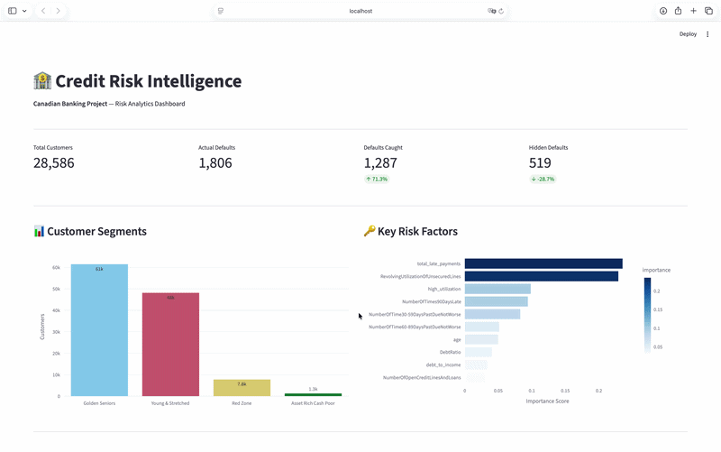

# 🏦 Canadian Bank Credit Risk Intelligence

## Predicting Loan Default Risk for Canadian Banking Institutions

<div align="center">
  
</div>

<br>


---

## 📋 Project Overview

End-to-end data science project focused on **credit risk analysis** for the Canadian banking sector. Using real-world financial data, this project builds a complete pipeline — from raw data to an interactive risk dashboard — demonstrating the analytical skills required for **Risk Analytics** and **Data Analyst** roles at institutions such as RBC, TD Bank, Scotiabank, BMO, and CIBC.

---

## 🎯 Business Problem

Canadian banks issue millions of personal loans annually. Each defaulting customer represents a direct capital loss. The challenge is to **identify high-risk customers before credit is granted** — reducing losses while avoiding the unfair exclusion of reliable borrowers.

---

## 📊 Dataset

- **Source:** [Give Me Some Credit — Kaggle](https://www.kaggle.com/competitions/GiveMeSomeCredit)
- **Size:** 150,000 customers, 11 financial variables  
- **Target:** `SeriousDlqin2yrs` — whether a customer experienced 90+ days delinquency

---

## 🔍 Key Results

| Metric                | Logistic Regression | Random Forest |
|----------------------|-------------------|---------------|
| AUC-ROC              | 0.79              | **0.86**      |
| Recall (Default)     | 0.14              | **0.71**      |
| Precision (Default)  | 0.60              | 0.22          |

> **Business Insight:** The Random Forest model captures **71% of actual defaulters**, which is a critical improvement for minimizing a bank's capital loss compared to traditional baseline models.

---

## 🗂️ Project Structure

```text
credit-risk-project/
│
├── data/                         # Datasets (not tracked by Git)
├── notebooks/
│   ├── 01_exploracao_inicial.ipynb   # Data loading & overview
│   ├── 02_eda.ipynb                  # Exploratory data analysis
│   ├── 03_feature_engineering.ipynb  # Feature creation
│   ├── 04_modeling.ipynb             # ML modeling & evaluation
│   ├── 05_segmentation.ipynb         # K-Means customer segmentation
│   └── 06_sql_analysis.ipynb         # SQL business queries
├── src/
│   └── queries.sql               # 5 business SQL queries
├── dashboard/
│   ├── app.py                    # Streamlit interactive app
│   └── model.pkl                 # Trained Random Forest Model
└── README.md                     # Project documentation
```
 
---

## 🛠️ Tech Stack

| Tool           | Purpose                                      |
|----------------|----------------------------------------------|
| Python         | Core language & analysis                     |
| Pandas         | Data manipulation                            |
| Scikit-learn   | Machine learning (Random Forest)             |
| SQL + SQLite   | Advanced business queries                    |
| Streamlit      | Interactive dashboard & simulation           |
| Plotly         | High-fidelity interactive visualizations     |
| Git + GitHub   | Version control & documentation              |

---

## 📦 Customer Segments (K-Means)

| Segment                  | Default Rate | Profile                                      |
|--------------------------|-------------|----------------------------------------------|
| 🟢 Golden Seniors        | 2%          | High income, low utilization, age 60+        |
| 🔴 Red Zone              | 39%         | High late payments, maxed credit             |
| 🟡 Young & Stretched     | 7%          | Young, moderate usage                        |
| 🟠 Asset Rich Cash Poor  | 5%          | High debt ratio, lower income                |

---

## 🚀 How to Run

```bash
# Clone the repository
git clone https://github.com/PedroAlbuquerque25/credit-risk-project.git
cd credit-risk-project

# Create virtual environment
python -m venv venv
source venv/bin/activate

# Install dependencies
pip install pandas numpy scikit-learn matplotlib seaborn streamlit plotly watchdog

# Run the dashboard
streamlit run dashboard/app.py
```

---

## 👤 Author

**Pedro Albuquerque**  
Data Scientist | Data Scientist Data Analyst 

[GitHub](https://github.com/PedroAlbuquerque25)

## 🤝 Contact
[](https://www.linkedin.com/in/phaa/)